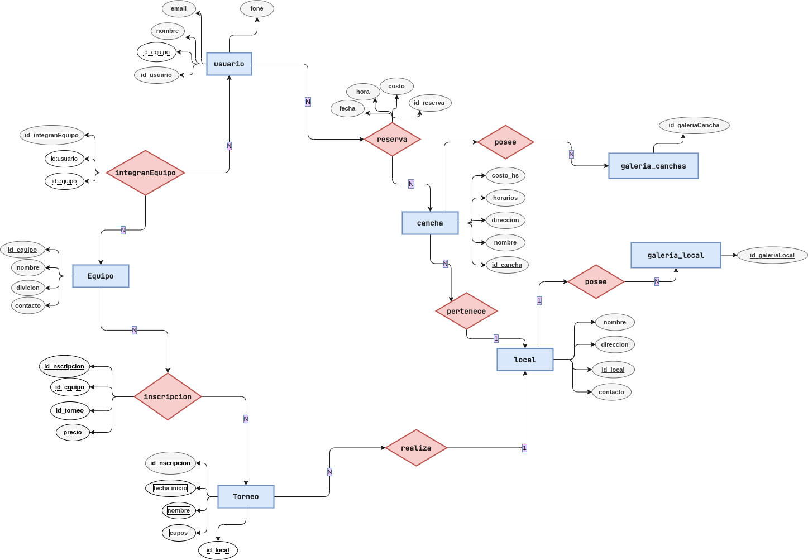

# FootballConnect, posible proyecto

## Descripción

"FootballConnect" es una aplicación web diseñada para conectar equipos de fútbol y facilitar la organización de partidos. La plataforma ofrece las siguientes funcionalidades:

1. **Visualización de canchas**: Los usuarios podrán ver un listado de canchas de fútbol disponibles en la zona, tanto pagas como públicas. Cada cancha mostrará información relevante, como ubicación, días y horarios disponibles, y el costo por hora.

2. **Reserva de canchas**: Los equipos podrán reservar turnos en las canchas de su elección. Podrán seleccionar el día y la hora en la que deseen jugar, y realizar el pago correspondiente a través de una integración con Mercado Pago u otra pasarela de pagos.

3. **Desafío de equipos**: Si un equipo ha reservado un turno y no tiene contrincante, podrá ponerse en modo desafío. Esto permitirá a otros equipos unirse al partido y compartir el costo de la cancha. También podrán desafiar a equipos específicos para jugar contra ellos.

4. **Galería de canchas**: Cada cancha tendrá una galería de imágenes que mostrará sus instalaciones y servicios. Además, se mostrarán los precios de los servicios adicionales, como alquiler de indumentaria, venta de accesorios y remeras personalizadas de fútbol.

5. **Torneos y eventos destacados**: La plataforma contará con una sección dedicada a torneos y eventos destacados en la zona. Los equipos podrán participar en torneos cortos organizados, o consultar información sobre eventos especiales relacionados con el fútbol.

6. **Integración con APIs**: Se podrán integrar APIs relacionadas con clima para verificar las condiciones climáticas antes de reservar una cancha, y APIs de comunicación para facilitar la comunicación entre los equipos, como la integración con Twitch para realizar transmisiones en vivo de los partidos.

## Paleta de colores sugerida

- **Color de fondo de la web**: #F0F2F5
- **Color del título**: #2D4059
- **Color del párrafo**: #5C7A89
- **Color de los elementos destacados**: #FF6B6B
- **Color de fondo de la barra de navegación**: #2D4059
- **Color de fondo del botón de navegación**: #FF6B6B
- **Color del texto de navegación**: #FFFFFF
- **Color del texto de navegación en hover**: #5C7A89

## MER prueba1

